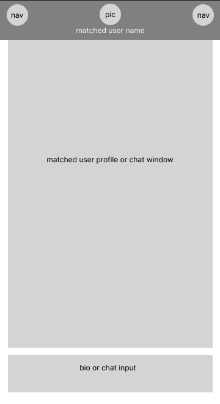
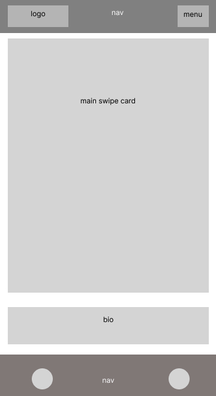

# KEROSENE DATING-APP - "Can you handle the heat?"
### A project by [Chris](https://github.com/ChristopherHendrickson), [Travis](https://github.com/Travis-Esselink) and [Adora](https://github.com/AdoraWyne)

Check out the heatest dating app [here](kerosene-date.herokuapp.com)!

**Username**: Dido

**Password**: 1234

## About the Project
Our project is to build a dating app with the swiping function.

## Technologies Used:
* CSS
* Bootstrap
* Javascript
* Node.js
* Express.js
* React
* MongoDB Cloud
* Firebase
* Github
* Heruko

## Features
* Users can register a new account, edit the profile information and delete their profile once found the true love. 
* Not only the users can upload one profile picture, they can upload multiple pictures in their gallery and all the images will be shown in carousel.
* Swiping function based on users' preferences.
* Once swiped left (not interested), the un-interested profiles will never be shown again.
* With the chatting function, once swiped right and it's a matched, users can start chatting with the matched profiles. On Chat UI, the users can preview part of the latest message.
* Users can unmatch anytime they want and all the chat history will be deleted. 
* The app is styled with responsive design but the design aiming for mobile devices.

## General Approach
We had a few ideas of what to do with our first group project and we chose dating app eventually thinking this would be fun!

We started by discussing what functions we want it to be in our app. Then discuss how to structure our model, then the routes and components. 

Once we have roughly idea, we proceeded to sketch the user interface by using Paint.

Wireframe:

Matched Users List         |  Matched User Profile     | Main Page (Swiping Card) |
:-------------------------:|:-------------------------:|:-------------------------:
 | |  |

We distributed the tasks based on personal's strength and had a few discussion everyday to make sure everyone is on the same page.

## Challenges
### The Swiping Function
We were thinking to use CSS Animation to do the swiping part. However, we found a react-tinder-card package that we can user for this project. Kudos to the creator!
The only thing we need to do in order to use this package is install two dependencies into the project and the version we need to install is react-tinder-card at version 1.5.4. 

Otherwise, the code will run into error. It seems like an error from the creator, an issue has been filed to the creator on his gibhub on this package.
```
npm install --save react-tinder-card@1.5.4
```
And, because our app is React app, so it need to install below as well:
```
npm install --save @react-spring/web@9.5.5
```
You can also read more about this package at [here](https://www.npmjs.com/package/react-tinder-card).

### Private Routes
We set all the routes as PrivateRoute or PrivateAndSetUpRoute except the Landing Page. However, after logged in and refreshed the page, it will kick the user back to Landing Page while the user is still logged in. 

To solve this, We made a new state as userFetched. The initial value of userFetched is false while waiting for the backend to check and send back to frontend of whether there is a logged-in user. And when the userFetched is false, we will render the loading page that has been specified in all the children components as conditional rendering. 

Once frontend has the info of who is the logged-in user or there is no logged-in user, userFetched will be set as true. Then, it will render based on what we set in the PrivateRoute or PrivateAndSetUpRoute if there is a logged-in user or not.

### Chat Function with Firebase
Firebase Realtime Database implementation into react proved to be a challenge at first,  as there were several syntax discrepancies across previous and current firebase versions. 

These syntax issues were consolidated by consulting the offical google [firebase documentation](https://firebase.google.com/docs/web/modular-upgrade) for the most recent firebase release.

## Credits & Acknowledgement
To our instructor- Dido and TA- Rob guided us throughout the project.

Images are from:
* [Unsplash](https://unsplash.com/)
* [Icons8](https://icons8.com/)
* [Flaticon](https://www.flaticon.com/)

